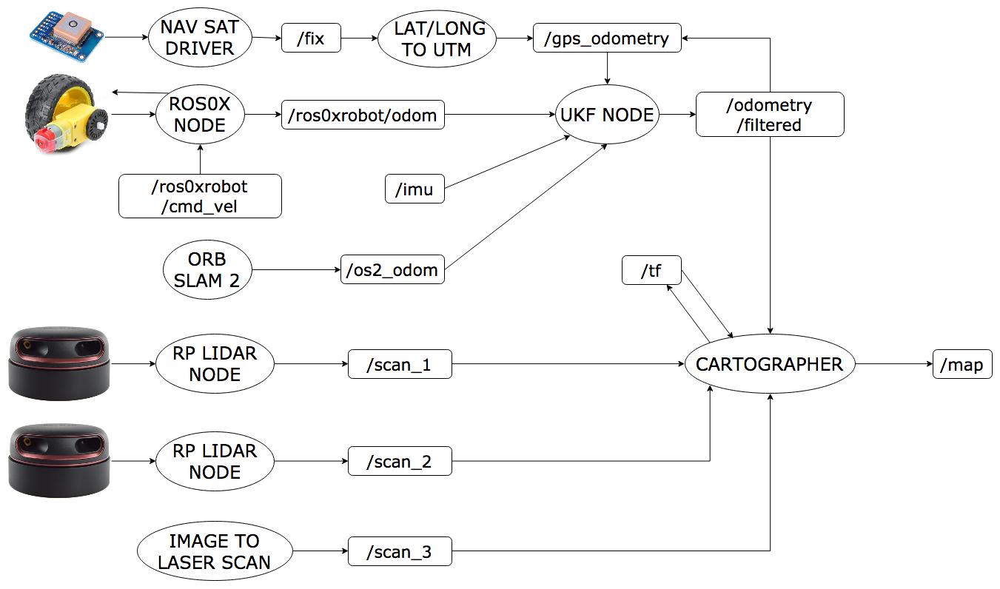
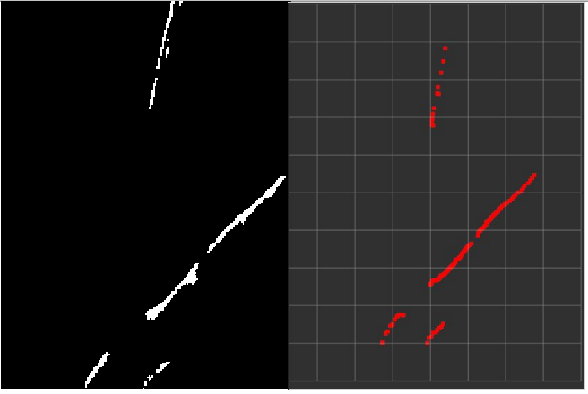
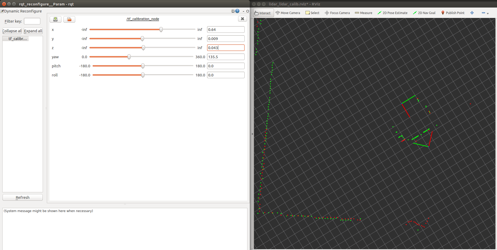

# Localization and Mapping
Overview of the subsystem:

Note : Ellipses correspond to ROS Nodes and Rectangles correspond to the corresponding topics.

##  Build and Working Status
|Node|Build Status|Working Status|Credits|Future Work|
|----|------------|--------------|-------|------|
|cartographer_ros|||[Google Cartographer](https://github.com/googlecartographer)|Tuning Parameters|
|img_to_laser|||[IGVC IITK](https://github.com/IGVC-IITK) (Built from scratch)|Adding support for multiple virtual lidars|
|robot_localization|||[Charles River Analytics](https://github.com/cra-ros-pkg/robot_localization)|Tweaking Parameters|
|ros0xrobot|||[NEX Robotics](http://www.nex-robotics.com/)|-|
|scanignore|||[IGVC IITK](https://github.com/IGVC-IITK) (Built from scratch)|-|
|tf_calibration|||[IGVC IITK](https://github.com/IGVC-IITK) (Built from scratch)|-|
## cartographer_ros
[Cartographer](https://github.com/googlecartographer/cartographer) is a system that provides real-time simultaneous localization and mapping ([SLAM](https://en.wikipedia.org/wiki/Simultaneous_localization_and_mapping)) in 2D and 3D across multiple platforms and sensor configurations.

## img_to_laser

This node gives laser scan as read by a virtual LiDAR put at some position on binary classified image. Used for mapping the data obtained from the vision pipeline via mapping nodes that require data to be in laser scan form only.

## robot_localization

This node gives sensor-fused odometry. (Currently using wheel encoders, visual odometry and an IMU).

It is an open-source ROS package. Added an extra feature. Measured, calculated and tuned covariance matrices based on the robot dynamics, sensor configuration and the environment conditions.

## ros0xrobot

This node gives raw wheel odometry (and also provides a low-level controller) for the Firebird 0xDelta robot. This node is basically a driver for the robot's motors and encoders.

Acquired from NEX Robotics and added some fixes.

## scanignore

This node generates filtered scans from the laser scan topics by removing range data that corresponds to points on the robot itself (so that the robot does not map itself).

Configured for the Firbird 0xDelta (Daksh IITK).

## tf_calibration

This is a **one-time** node used for calibrating sensor frames. It just publishes a tf that can be updated in real time using dynamic_reconfigure. One can visualize the sensor data on Rviz and then tune the tf till the data matches visually. Was used for LiDAR-LiDAR calibration on the Firebird 0xDelta.

